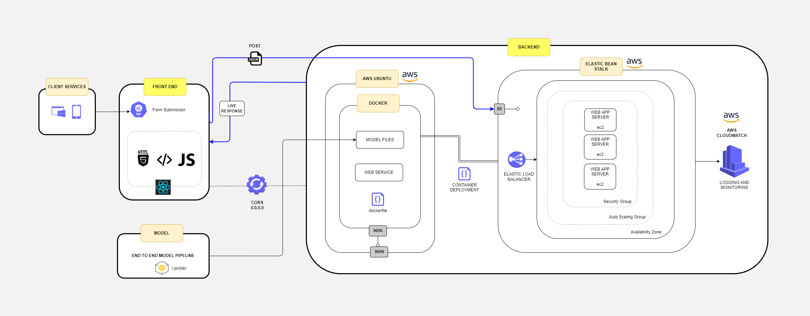

# Streaming at Scale - MLOps



## Introduction

Streaming at Scale - MLOps is dedicated to deploying machine learning models at scale while tackling operational hurdles like dead letter queues, autoscaling, right fitting, and FILEIO concerns. It presents a robust architecture for efficiently managing machine learning pipelines in production environments.

## Purpose of the Project

In the rapidly evolving landscape of AI, the advent of platforms like OpenAI has significantly democratized the process of building machine learning models. However, despite the accessibility of model development, the true litmus test lies in the seamless deployment and management of these models in real-world production environments.

The core objective of this project transcends mere model creation; it is fundamentally about navigating the intricate challenges of deploying machine learning solutions at scale. By strategically focusing on addressing operational hurdles and meticulously sculpting architectural blueprints, the aim is to forge a robust and adaptable framework. This framework not only ensures the reliable deployment of machine learning models but also fosters scalability and sustainability in the face of evolving business demands.

## Technical Details and MLOps Features

### Cost Optimization

- #### Environment Configuration
    AWS Elastic Beanstalk (EB) allows for defining environment configurations tailored to the application's requirements, optimizing resource allocation and avoiding over-provisioning.

- #### Auto-Scaling
    EB supports automatic scaling based on metrics like CPU utilization, ensuring optimal resource utilization and minimizing costs during peak and off-peak periods.

- #### Resource Tagging
    AWS resource tagging enables effective cost tracking and allocation, allowing for accurate expense distribution across departments or projects.

-   #### Cost Explorer Integration
    Integration with AWS Cost Explorer provides detailed cost breakdowns for EB environments, facilitating analysis and identification of optimization opportunities.

### High Availability

- #### Multi-AZ Deployment
    EB deploys applications across multiple Availability Zones (AZs), ensuring fault tolerance and high availability even in the event of AZ failures.

- #### Load Balancing
    Integration with Elastic Load Balancing (ELB) distributes incoming traffic across instances, automatically routing traffic away from unhealthy instances to maintain availability.

- #### Rolling Updates
    Rolling updates during application deployment ensure continuous availability by gradually replacing instances with new versions, minimizing downtime for end users.

### Security and Compliance

- #### HTTPS Support
    EB enables HTTPS for applications, encrypting data transmission to enhance security and protect sensitive information from interception.

- #### IAM Integration
    Integration with AWS Identity and Access Management (IAM) allows for fine-grained access control, ensuring only authorized users can manage EB environments and access resources.

- #### Compliance Certifications
    By deploying on EB, inherit AWS's comprehensive compliance certifications (SOC 1/2/3, PCI DSS, HIPAA, GDPR), helping meet regulatory requirements and industry standards.

- #### Security Patching
    Automatic security patching by EB ensures underlying operating systems and runtime environments remain up-to-date, safeguarding against known vulnerabilities.

### Docker Integration

- #### Containerization
    The machine learning model and preprocessor are containerized using Docker, allowing for consistent and portable deployment across different environments.

- #### Deployment in Elastic Beanstalk
    The Docker containers are deployed in AWS Elastic Beanstalk, leveraging its management capabilities for scalable and reliable deployment.

## Flow Overview

The MLOps workflow initiates as the user interacts with the frontend interface, triggering a chain of technical processes. Upon form submission, the frontend application sends an HTTP POST request to the backend web service hosted on Elastic Beanstalk (EB), targeting port 80, the default HTTP port. This request is received by the EB environment, which serves as a load balancer distributing incoming traffic across multiple EC2 instances.

At the backend level, the EB environment communicates with the Docker container housing the machine learning model. This communication involves fetching the model files and preprocessing components required for data transformation and prediction generation. The Docker container, configured to expose port 9696 to external traffic, listens for incoming requests from the EB environment.

Upon receiving the request, the Docker container preprocesses the input data and passes it through the machine learning model for prediction generation. The model execution pipeline, encapsulated within the Docker container, leverages the computational resources of the EC2 instance to efficiently process the data and compute predictions.

Once predictions are generated, the Docker container sends the results back to the EB environment over port 9696. The EB environment, acting as a reverse proxy, forwards the response to the frontend application via the original HTTP connection established by the user's form submission.

Throughout this process, Elastic Beanstalk's auto-scaling mechanisms continuously monitor the workload on the backend environment. Metrics such as CPU utilization, request count, and response times are analyzed to dynamically adjust the number of EC2 instances hosting the backend service. This auto-scaling capability ensures that the infrastructure can efficiently handle fluctuations in demand, optimizing resource utilization and maintaining responsive performance.

## Project Structure

```
├─ README.md
└─ scaling-mlops
   ├─ .git
   ├─ .gitignore
   ├─ .gitmodules
   ├─ .pytest_cache
   ├─ backend
   │  ├─ .pytest_cache
   │  │  ├─ .gitignore
   │  │  ├─ CACHEDIR.TAG
   │  │  ├─ README.md
   │  ├─ classification
   │  │  ├─ code
   │  │  │  ├─ 14-explore-more.md
   │  │  │  ├─ notebook-scaling-ohe.ipynb
   │  │  │  └─ notebook.ipynb
   │  │  ├─ data
   │  │  │  ├─ meta.csv
   │  │  │  └─ meta.json
   │  │  └─ README.md
   │  ├─ deployment
   │  │  ├─ code
   │  │  │  ├─ .gitignore
   │  │  │  ├─ 05-train-churn-model.ipynb
   │  │  │  ├─ Dockerfile
   │  │  │  ├─ model_C=1.0.bin
   │  │  │  ├─ ping.py
   │  │  │  ├─ Pipfile
   │  │  │  ├─ Pipfile.lock
   │  │  │  ├─ plan.md
   │  │  │  ├─ predict-test.py
   │  │  │  ├─ predict.py
   │  │  │  └─ train.py
   │  │  ├─ data
   │  │  │  ├─ meta.csv
   │  │  │  └─ meta.json
   │  │  └─ README.md
   │  ├─ evaluation
   │  │  ├─ code
   │  │  │  └─ notebook.ipynb
   │  │  ├─ data
   │  │  │  ├─ meta.csv
   │  │  │  └─ meta.json
   │  │  └─ README.md
   │  └─ tests
   ├─ docs
   │  ├─ images
   │  │  └─ streamingatscale.png
   │  └─ streamingatscale.drawio
   ├─ LICENSE
   ├─ README.md
   ├─ requirements-test.txt
   ├─ requirements.txt
   └─ scaling-mlops-webapp
      ├─ .git
      ├─ .gitignore
      ├─ LICENSE
      ├─ package-lock.json
      ├─ package.json
      ├─ public
      ├─ README.md
      ├─ src
      │  ├─ App.css
      │  ├─ App.js
      │  ├─ App.test.js
      │  ├─ index.css
      │  ├─ index.js
      │  ├─ logo.svg
      │  ├─ MyComponent.css
      │  ├─ MyComponent.js
      │  ├─ ProjectInfo.js
      │  ├─ reportWebVitals.js
      │  └─ setupTests.js
      └─ tests
         └─ test.py
```

## Installation

To install and set up the project locally, follow these steps:

### Prerequisites

- Node.js (version X.X.X)
- Docker
- Python (version X.X.X)

### Installation Steps

1. **Clone the Repository**: Clone the project repository to your local machine:
   ```
   git clone https://github.com/your-username/your-repository.git
   ```

2. **Install Frontend Dependencies**: Navigate to the `frontend` directory and install the required dependencies:
   ```
   cd frontend
   npm install
   ```

3. **Install Backend Dependencies**: Navigate to the `backend` directory and install the required Python dependencies:
   ```
   cd backend
   pip install -r requirements.txt
   ```

4. **Set Up Environment Variables**: Set up any necessary environment variables required for the backend, such as API keys or database connection strings.

## Usage

To use the project, follow these steps:

1. **Start Frontend Development Server**: Navigate to the `frontend` directory and start the frontend development server:
   ```
   cd frontend
   npm start
   ```

2. **Start Backend Server**: Navigate to the `backend` directory and start the Flask server:
   ```
   cd backend
   python app.py
   ```

3. **Access the Application**: Open your web browser and navigate to `http://localhost:3000` to access the frontend application.

## Testing

To run tests for the project, follow these steps:

- **Frontend Tests**: Navigate to the `frontend` directory and run frontend tests:
  ```
  cd frontend
  npm test
  ```

- **Backend Tests**: Navigate to the `backend` directory and run backend tests:
  ```
  cd backend
  pytest
  ```

## Next Steps or Idea Board

- Convert this project into serverless compute
- Include CI/CD
- Automated Testing

## Contributing

If you'd like to contribute to the project, please follow these guidelines:

- Report Bugs: If you encounter any bugs or issues, please open a new issue on GitHub.
  
- Suggest Improvements: If you have any suggestions for improvements or new features, please feel free to submit a pull request.
  
- Follow Coding Standards: Please ensure that your contributions adhere to the project's coding standards and style guidelines.

## License

This project is licensed under the MIT License.

## Author

Akshit Miglani: [Linkedin](https://www.linkedin.com/in/akshitmiglani/) | akshit.miglani09@gmail.com


